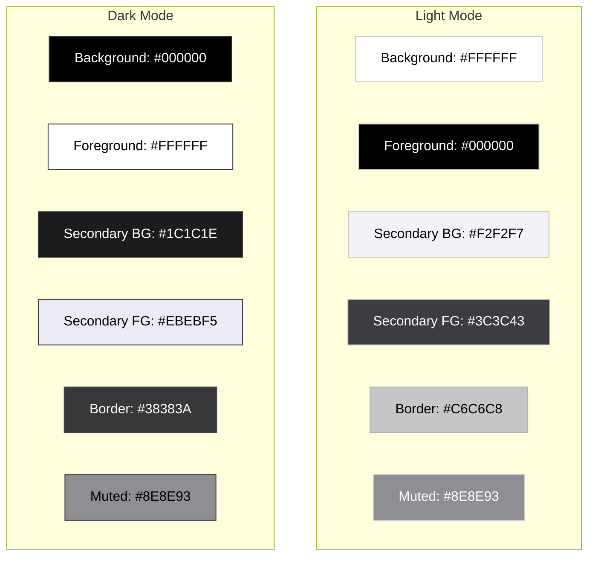
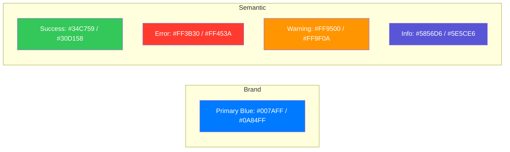

# 프로젝트 디자인 스타일가이드 (Styleguide)

이 문서는 Seesaw Chat 프로젝트의 일관된 UI/UX 유지를 위한 디자인 시스템 가이드입니다. NativeWind(Tailwind CSS)를 기반으로 하며, 모든 UI 컴포넌트와 스타일은 이 가이드를 준수해야 합니다.

---

## 1. Color System (컬러 시스템)

프로젝트의 브랜드 아이덴티티와 정보 전달을 위한 컬러 팔레트입니다. `tailwind.config.js` 및 `global.css`에 정의된 테마 토큰을 사용하며, 다크 모드를 지원합니다.

### 1.1 Color Mode Comparison (모드별 컬러 대비)

### 1.2 Theme Palette

| 구분             | Light Mode | Dark Mode | 설명                                   |
|:---------------|:-----------|:----------|:-------------------------------------|
| **Background** | `#FFFFFF`  | `#000000` | 기본 배경색 (`bg-background`)             |
| **Foreground** | `#000000`  | `#FFFFFF` | 기본 텍스트색 (`text-foreground`)          |
| **Border**     | `#C6C6C8`  | `#38383A` | 경계선 및 테두리 (`border-border`)          |
| **Muted**      | `#8E8E93`  | `#8E8E93` | 비활성/보조 텍스트 (`text-muted-foreground`) |

### 1.3 Brand & Semantic Colors

### 1.4 Color Gradients (컬러 그라데이션)

주요 강조 요소나 배경에 사용되는 표준 그라데이션 조합입니다. (iOS 스타일 가이드 참고)

- **Primary Gradient**: 브랜드 메인 컬러를 활용한 그라데이션
    - `from-primary-400 to-primary-600`
    - 시각적 표현: `#5AA1FF` → `#0062CC`
- **Dark Surface**: 다크 모드 카드 또는 표면용 그라데이션
    - `from-zinc-800 to-black`
    - 시각적 표현: `#27272A` → `#000000`

---

## 2. Typography (타이포그래피)

NativeWind의 유틸리티 클래스를 사용하여 텍스트의 일관성을 유지합니다.

| 구분               | 클래스                      | 크기 (px/rem)     | 설명            |
|:-----------------|:-------------------------|:----------------|:--------------|
| **Heading 1**    | `text-3xl font-bold`     | 30px / 1.875rem | 화면 메인 타이틀     |
| **Heading 2**    | `text-2xl font-semibold` | 24px / 1.5rem   | 섹션 타이틀        |
| **Heading 3**    | `text-xl font-medium`    | 20px / 1.25rem  | 소제목, 카드 제목    |
| **Body (Large)** | `text-lg`                | 18px / 1.125rem | 강조 본문         |
| **Body (Base)**  | `text-base`              | 16px / 1rem     | 기본 본문 텍스트     |
| **Body (Small)** | `text-sm`                | 14px / 0.875rem | 보조 설명, 리스트 항목 |
| **Caption**      | `text-xs`                | 12px / 0.75rem  | 캡션, 힌트 텍스트    |

---

## 3. Spacing & Grid (여백 및 그리드)

### 3.1 Spacing Scale

Tailwind CSS의 기본 4px 단위를 준수합니다.

- `p-1` (4px), `p-2` (8px), `p-4` (16px), `p-6` (24px), `p-8` (32px)
- 컴포넌트 간 간격은 주로 `gap-2` (8px) 또는 `gap-4` (16px)를 사용합니다.

### 3.2 Layout Guidelines

- **Screen Padding**: 모바일 화면 양 옆 여백은 최소 `px-4` (16px)를 유지합니다.
- **Safe Area**: `SafeAreaView` 또는 `expo-status-bar`를 고려하여 상단 여백을 처리합니다.

---

## 4. Common Components (공통 컴포넌트)

`components/ui` 폴더 내에 구현된 표준 컴포넌트 사용법입니다.

### 4.1 Buttons

- **Primary Button**: `bg-primary-500 text-white rounded-lg p-3`
- **Ghost Button**: `bg-transparent text-primary-500 border border-primary-500`

### 4.2 Inputs

- 기본 입력창 스타일: `border border-gray-300 rounded-md p-2 focus:border-primary-500`

### 4.3 Lists

- `features/friends/components/FriendListItem.tsx`와 같이 일관된 리스트 아이템 구조를 따릅니다.

---

## 5. Implementation Guide (구현 가이드)

1. **NativeWind 활용**: 가급적 인라인 스타일보다는 Tailwind 클래스를 사용하세요.
2. **테마 확장**: 새로운 공통 컬러가 필요한 경우 `tailwind.config.js`에 추가하세요.
3. **다크 모드**: `dark:` 접두사를 활용하여 `global.css`의 변수와 매칭되는 다크모드 대응을 고려하세요.
