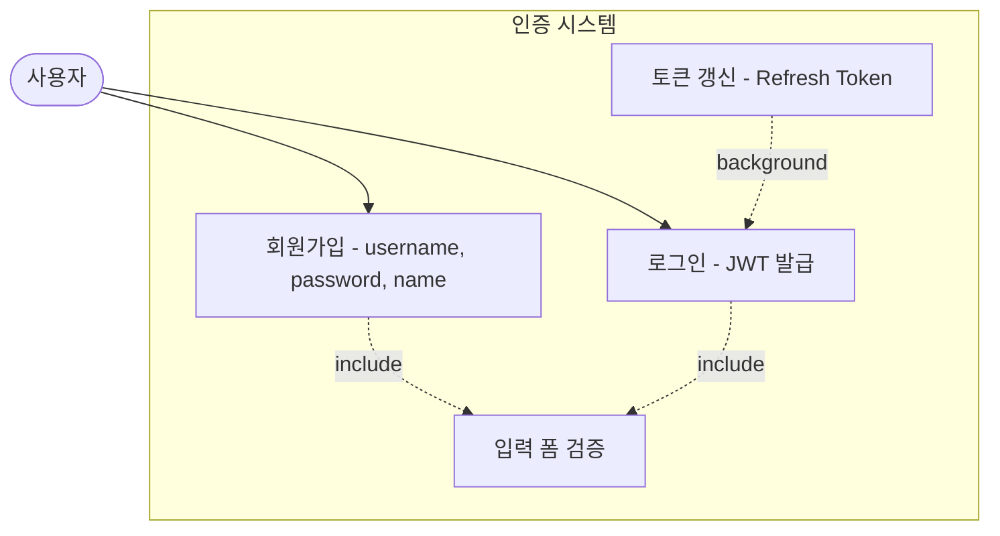
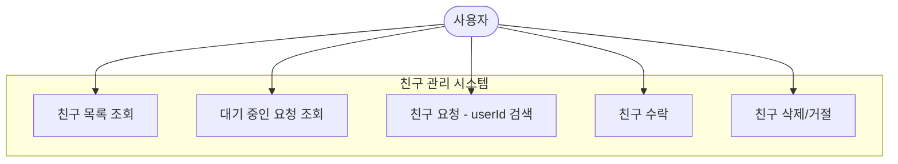
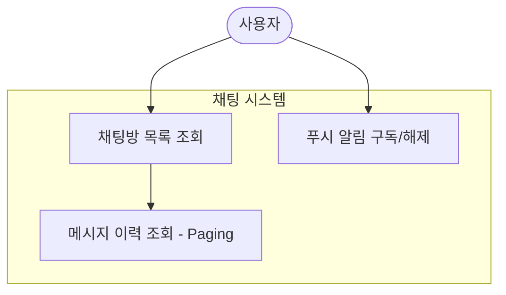
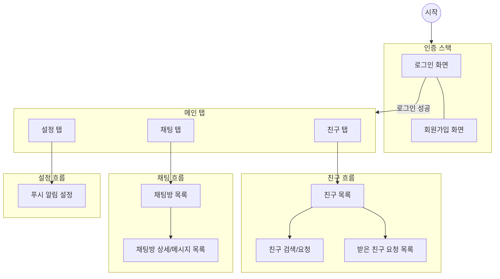

# Use Case: 회원가입, 친구 관리 및 채팅 내비게이션 구조

이 문서는 `seesaw_chat` 서비스의 주요 유즈케이스와 화면 흐름을 `api-docs.yaml` 명세를 기반으로 Mermaid 다이어그램으로 정의합니다.

## 1. 주요 유즈케이스

### 1.1 인증 및 계정 관리
회원가입 시 사용자명, 비밀번호, 이름을 입력받으며, JWT 기반의 로그인 및 토큰 갱신(Refresh Token)을 지원합니다.

### 1.2 친구 관리
친구 목록 조회, 요청, 수락, 거절 및 삭제 기능을 포함합니다.

### 1.3 채팅 및 메시지
참여 중인 채팅방 목록을 확인하고, 메시지 이력을 페이징하여 조회합니다.

## 2. 화면 내비게이션 흐름

앱의 전체적인 내비게이션 구조는 **Stack Navigation** (인증/상세)과 **Bottom Tab Navigation** (메인)으로 구성됩니다.

## 3. 기능 상세

### 3.1 인증 (Authentication)
- **회원가입**: `username`, `password`, `name` 필드를 입력받아 계정을 생성합니다.
- **로그인**: `username`, `password`로 인증 후 `accessToken`, `refreshToken`을 발급받습니다.
- **자동 로그인**: 저장된 `refreshToken`을 사용하여 `accessToken`을 주기적으로 갱신합니다.

### 3.2 친구 (Friends)
- **목록**: 현재 수락된(`ACCEPTED`) 친구 목록을 출력합니다.
- **요청/검색**: 상대방의 `userId`를 통해 친구를 요청합니다.
- **수락 대기**: 나에게 온 요청(`PENDING`) 목록을 확인하고 수락하거나 거절/삭제합니다.

### 3.3 채팅 (Chat)
- **채팅방 목록**: 사용자가 속한 채팅방 리스트를 보여줍니다.
- **메시지 이력**: 채팅방 진입 시 과거 메시지를 페이징(`pageNumber`, `pageSize`)하여 불러옵니다.
- **실시간 알림**: 웹 푸시 구독(`PushSubscription`)을 통해 새로운 메시지 알림을 수신합니다.

### 3.4 시스템 (System)
- **푸시 구독**: 기기 정보(`deviceName`, `userAgent`)와 함께 푸시 엔드포인트를 등록하여 알림을 관리합니다.
